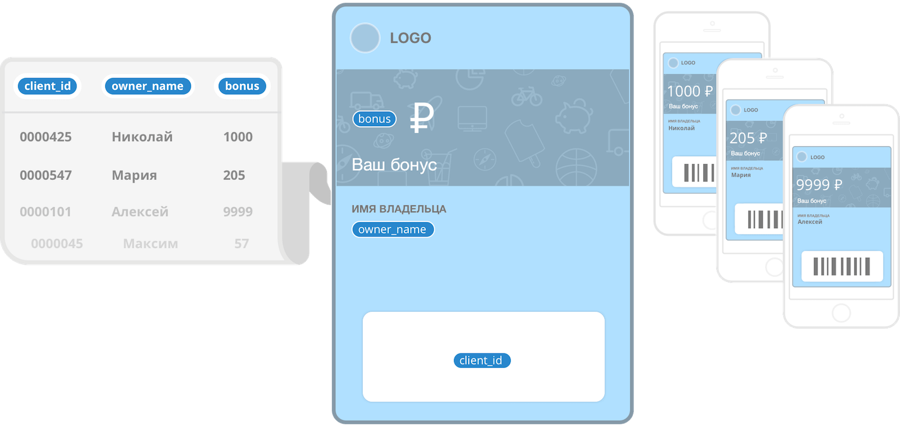

# card2b — API documentation

[Card2b](todo) — сервис для создания и выпуска электронных карточек. Здесь представлено наше API.

Всё, что можно сделать в интерфейсе внутри сервиса — то же самое можно делать и по API. 
Маленькие организации вполне могут обходиться и без API: просто делайте всё в браузере. Но для крупных необходима автоматизация.   

### С чего начать?

Вот отсюда: [быстрый старт](./doc/quick-start.md)

За несколько коротких шагов выпустим карточку, изменим, отправим уведомление.

### Более подробная документация?

Можно заглянуть сюда: [Концепция: данные, шаблоны и карты](./doc/basic-concepts.md). 
Про данные, подстановки, версионирование и статистику.

[Здесь](./working-with-api.md) — про работу с API и обработку ошибок. 

И полная документация: [по API карточек](./cards.md) и [по API шаблонов](./templates.md).
  

### Там было что-то про сертификаты

Да, это очень важный раздел. 
Если Вы представляете организацию, то для выпуска карточек Вашим клиентам, лучше обзавестись Apple сертификатом.

Зачем? Прочитайте здесь: [FAQ по сертификатам](./certs/certs-faq.md). 
А чтобы сделать свой, воспользуйтесь [Как создать сертификат: подробная инструкция](./certs/cert-creation.md)    

### Вопросы, предложения

Пишите в Issues или на {domain@email}.
