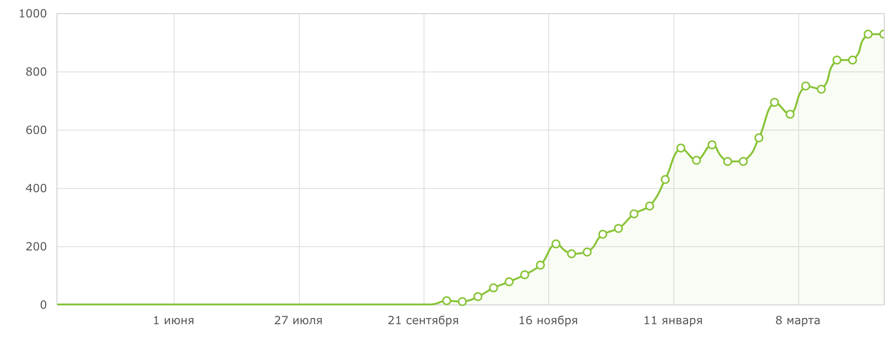

# card2b — концепция: данные, шаблоны и карты

Лучше всего проиллюстрирует картинка:

    

Если предположить, что карточка состоит только из этих полей, тогда:

* *bonus*, *owner_name*, *status* — это данные, которые нужно подставить в шаблон, чтобы выпустить карточку
* **full_data** у карточки — это объект 

```json
{
  "bonus": 5,
  "owner_name": "Иван Петров",
  "status": "Начальный"
}
```

* у всех выпущенных по этому шаблону карточек есть *bonus*, *owner_name*, *status*
* т.к. мы логически знаем, что *bonus* это число, то можно запросить сумму бонусов всех клиентов, или построить график изменения бонуса с течением времени   

> **Важно!** Выпущенные карточки могут отличаться только этими тремя полями! Так, заголовок "владелец" не меняется. 
Если нужно, чтобы у каких-то карточек было "владелец", у каких-то "имя держателя", то это должно тоже относиться к данным, типа *owner_header* (либо же эти 2 случая — просто разные шаблоны)


## Дефолтные данные и переопределение

Шаблон определяет **default_data**: значения, если они не переопределены конкретной карточкой:

```json
{
  "bonus": 0,
  "owner_name": "-",
  "status": "Начальный"
}
```

Предположим, мы выпускаем карточку через [/api/card/issue](./cards.md#api_card_issue). 
Мы указываем **override_data** — то, что нужно переопределить относительно шаблона. 
К примеру:

```json
{
  "owner_name": "Мария"
}
```

Тогда в выпущенной карточке **full_data** будет:

```json
{
  "bonus": 0,
  "owner_name": "Мария",
  "status": "Начальный"
}
```

> Если после выпуска изменить шаблон и переименовать *status = 'Базовый'*, то у Марии статус **изменится** (Начальный → Базовый), потому что он не переопределён. Если бы мы у неё был статус "VIP", то он не изменился бы.

Такое поведение — это удобно. По факту, данные конкретной карточки — это всего лишь переопределение данных по умолчанию. Так, если мы меняем шаблон и добавляем четвёртое поле *is_platinum = false*, оно становится таким у всех уже выпущенных карточек, так как не переопределено.


## Данные и версионирование

Пусть Мария получила 10 бонусов, Вы отправляете запрос [/api/card/update](./cards.md#post-/api/card/{card_id}/update-—-изменение-данных-карты) *override_data* =

```json
{
  "bonus": 10
}
``` 

Теперь актуальные данные — это

```json
{
  "bonus": 10,
  "owner_name": "Мария",
  "status": "Начальный"
}
```

При этом первая версия карточки по-прежнему доступна через [/api/card/get](./cards.md#get-/api/card/{card_id}-—-данные-конкретной-карточки). 
Т.е. в любой момент можно посмотреть полную историю версий, а также карточку на конкретный момент времени. 


## Данные и статистика

Вы сами определяете схему данных и их отображение, и для выпуска карточек оперируете только чистыми данными. 
Мы сохраняем все версии карточек при изменении данных или шаблона.

Благодаря этому, есть возможность получать срезы состояния по времени, а также строить графики. 
Например, получить график изменения суммарного баланса за последний год. Или график максимально доступной скидки. 
Или изменение количества карточек статуса "платинум" по времени.

Графики и статистику можно запрашивать [по api](./templates.md#get-/api/template/{template_id}/stat?...-—-детальная-статистика), 
но удобнее это делать в личном кабинете:   


  
