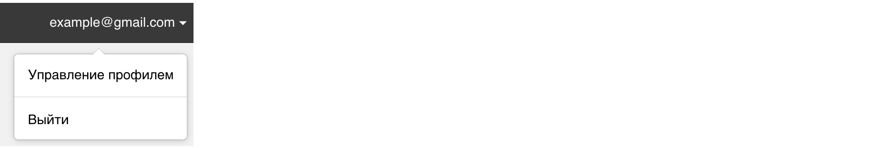
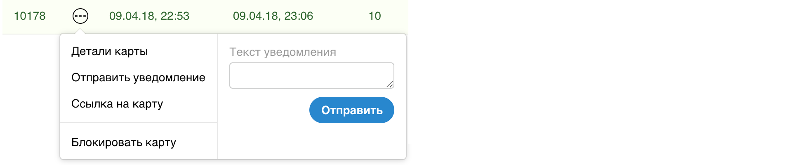

# card2b — быстрый старт по API

Создадим шаблон, а потом по API выпустим карточку, изменим, отправим уведомление.

Предполагается, что Вы уже зарегистрировались на {domain} и подтвердили e-mail.


## 1. Создаём шаблон

Идём по ссылке http://{domain}/cabinet/templates/new?example=apidoc . 
Нажимаем "Сохранить".


## 2. Получаем template_id и api_token

Идём на вкладку "Настройка и API". Там есть **template_id**.


Идём в "Управление профилем" вверху. Там есть **api_token**.




## 3. Выпускаем карточку по API

[Отправляем POST](./cards.md#api_card_issue). Подставьте **TOKEN** и **ID** шаблона:

```bash
curl -H "Content-Type: application/json" \
    "http://{domain}/api/card/issue?api_token=TOKEN" \
    -d '{"template_id":ID, "override_data": {"owner_name":"Мария"}}'
```  

Ответ будет примерно такой:

```json
{"card_id": 123456, "url": "https://{domain}/c/123456/4e370ec1d209d188"}
```

В кабинете на вкладке "Выпущенные карточки" она появилась: 


**Пройдите по ссылке url и установите карточку на свой телефон**. Это будто бы поставила Мария. 


## 4. Получаем карточку по API

[Делаем GET](./cards.md#api_card_get). Подставьте **TOKEN** и **ID** карточки: 

```bash
curl "http://{domain}/api/card/ID?api_token=TOKEN
```

Ответ будет [содержать карточку](./working-with-api.md#card):

```json
{
  "card_id": 123456,
  "url": "https://{domain}/c/123456/b5671f6713375e9b",
  "data": {
    "bonus": 0,
    "status": "Начинающий",
    "owner_name": "Мария"
  },
  "create_time": "2018-04-09T19:53:08.000Z",
  "update_time": "2018-04-09T19:53:08.000Z",
  "last_request_time": "2018-04-09T19:54:12.000Z",
  "n_installed": 1,
  "deactivated": false,
  "versions": [ 
    {"v_num":1, "valid_from": "2018-04-09T19:53:08.000Z"} 
  ]
}
```


## 5. Изменяем карточку по API

[Сделаем](./cards.md#api_card_update) Марии бонус 10. Подставьте **TOKEN** и **ID** карточки:

```bash
curl -H "Content-Type: application/json" \
    "http://{domain}/api/card/ID/update?api_token=TOKEN" \
    -d '{"override_data": {"bonus":10}}'
```  

В ответе будет

```json
{"card_id": 123456, "changed": true}
```

В течение нескольких секунд **на Вашем телефоне карточка должна обновиться**, а также будет уведомление, что новый бонус теперь 10₽ 
(оно показалось, т.к. установлено "уведомление при изменении" в дизайне шаблона).

Кстати, при этом создалась вторая версия карточки (если сделать GET как выше, будет видно). 


## 6. Отправляем уведомление на карточку

[Делаем POST](./cards.md#api_card_notify). Подставьте **TOKEN** и **ID** карточки:

```bash
curl -H "Content-Type: application/json" \
    "http://{domain}/api/card/ID/notify?api_token=TOKEN" \
    -d '{"notify_text": "Привет! Так можно делать вместо SMS-ок"}'
```  

На заблокированном экране Вашего телефона отобразится уведомление. На сайте это делается здесь:
 



## 7. Что дальше?

Получить все карточки шаблона можно через [/api/template/:id/cards](./templates.md#api_template_cards).

Карточки версионируются при изменении данных. Старые версии доступны [по api](./cards.md#api_card_get_vnum) и в UI.

Шаблоны тоже версионируются. Более того: изменение настроек/данных шаблона приводит к новым версиям всех выпущенных карточек.

Можно получать статистику. Например, сумму бонусов всех клиентов по времени.

Обо всём этом чуть подробнее написано в [концепции](./basic-concepts.md).

[Здесь](./working-with-api.md) — про работу с API и обработку ошибок. 
И полная документация: [по API карточек](./cards.md) и [по API шаблонов](./templates.md).

